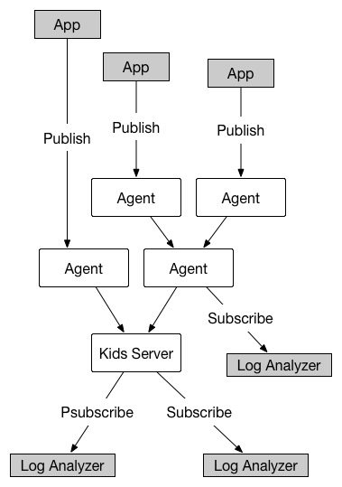

# kids

[![Build Status]][Travis CI]

Kids 是一个日志收集系统。

采用 [Scribe](https://github.com/facebookarchive/scribe) 的消息聚合模型和 [Redis](http://redis.io/) 的 pub/sub 模型。

## 特性

* 实时订阅
* 分布式收集，集中存储
* 多线程模型
* 使用 Redis 协议
* 无第三方依赖

## 安装

### 二进制包

在 [kids 的 Github releases page](https://github.com/zhihu/kids/releases) 有 linux 二进制发布包，deb 包。

deb 包里有个示例配置，如要部署到生产环境，请看[部署到生产环境](#production)。

### 从源码编译

编译 kids 需要 C++11 支持，如 GCC 4.7 或更高版本或 [Clang](http://clang.llvm.org)

下载 [源码发布包](https://github.com/zhihu/kids/releases)（文件名为 kids-VERSION.tar.gz），运行：
	
	tar xzf kids-VERSION.tar.gz
	cd kids-VERSION
    ./configure
    make
    make test  # optional
    make install

默认情况下，kids 会被安装至 `/usr/local/bin/kids`，使用 `--prefix` 选项设置指定的安装位置，运行 `./configure --help` 获取更多设置选项。

## 快速开始

Kids samples/ 文件夹带了一些示例配置，编译好后，运行：

	kids -c samples/dev.conf

kids 使用 redis 协议，现在你可以用 `redis-cli` 和它通信：

	$ redis-cli -p 3388
	$ 127.0.0.1:3388> PSUBSCRIBE *

在另一个终端：

	$ redis-cli -p 3388
    $ 127.0.0.1:3388> PUBLISH test message

`redis-cli` 命令需要安装 redis。在 MAC 上，可以用 `brew install redis` 安装它。
配置文件的具体选项详见 [配置](doc/config.zh_CN.md)。

执行 `kids --help` 查看更多选项。

## 部署到生产环境

我们在每台服务器上安装 kids agent，用于转发日志到中心的 kids server，部署后，可以使用任何一种语言的 redis 客户端 publish 日志到本地的 kids agent，而日志处理程序都从 kids server 订阅日志来消费。

为了简化部署，用 deb 包或者 docker 容器。

如果不需要把 kids 的配置文件包含在 deb 里，比如可以用 puppet 或 saltstack 管理 kids 的配置，那么，不需要自己编译，从 [kids 的 Github release page](https://github.com/zhihu/kids/releases) 下载 deb 包，部署时覆盖`/etc/kids.conf`就可以了。

### 配置文件

[请看这里](doc/config.md).

### 生成 deb 包

前提：

* [fpm](https://github.com/jordansissel/fpm)

下载 [kids 源码发布版](https://github.com/zhihu/kids/releases)，然后：

	tar xzf kids-VERSION.tar.gz
	cd kids-VERSION
    cp samples/agent.conf debian/kids.conf
    # EDIT kids.conf, minimally fill in server address
	make deb

Server 端，用同样的 deb 包，部署时用 server 端的配置文件覆盖 /etc/kids.conf 就好了。

### 使用 Docker

你可以用 docker 来生成可部署到生产环境的 kids container 或者用它来生成 kids deb 包。

首先：
	
	git clone https://github.com/zhihu/kids.git
	cd kids
	# or samples/server.conf
    copy samples/agent.conf debian/kids.conf
    # Edit kids.conf, minimally logfile should be set to stdout 
    # to make `docker logs` work if you run kids in a container.

#### 用 docker 生成 kids 镜像

在项目根目录，运行：
	  
	docker build -t zhihu/kids .

现在，你可以这样使用它：
	
	docker run -d -p 3388:3388 zhihu/kids

#### 用 docker 制作 deb 包

确保你已经生成了 kids 镜像，因为 `zhihu/kids-deb` 依赖它，运行：

    cd debian
    docker build -t zhihu/kid-deb .

现在，你可以使用这个镜像来生成 deb 包：
	
	docker run -v /path/to/save/deb:/deb zhihu/kids-deb

## 开发者

你需要以下东西来从源码编译 kids：

* build-essential
* libtool
* automake
* c++ compiler with c++ 11 support like gcc4.7+ or [Clang](http://clang.llvm.org)

运行以下命令编译 kids：

	./autogen.sh
	./configure
	make

## 开源协议

Kids 使用 BSD-3 协议，具体内容详见 LICENSE 文件。

## FAQ

Q: 为什么叫「kids」?  
A: 「kids」是「Kids Is Data Stream」的递归缩写。

## 架构图

[Build Status]: https://img.shields.io/travis/zhihu/kids/master.svg?style=flat
[Travis CI]:	https://travis-ci.org/zhihu/kids

